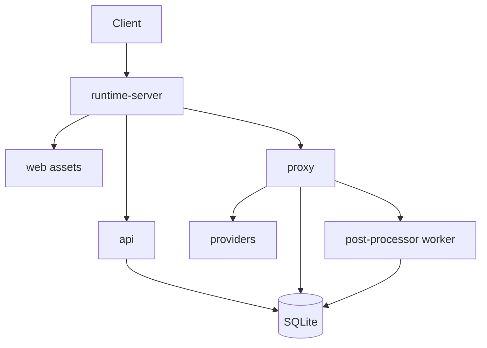
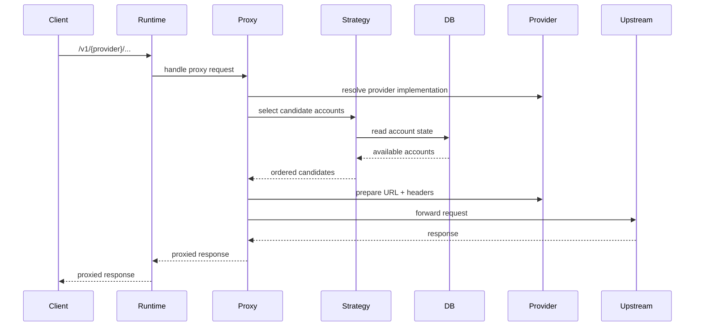
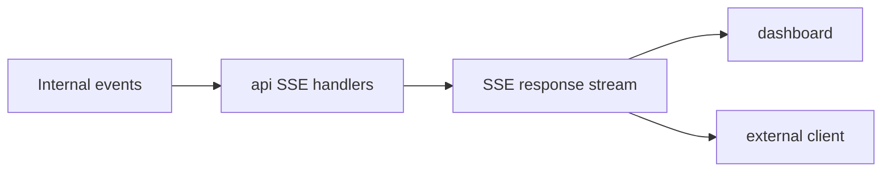
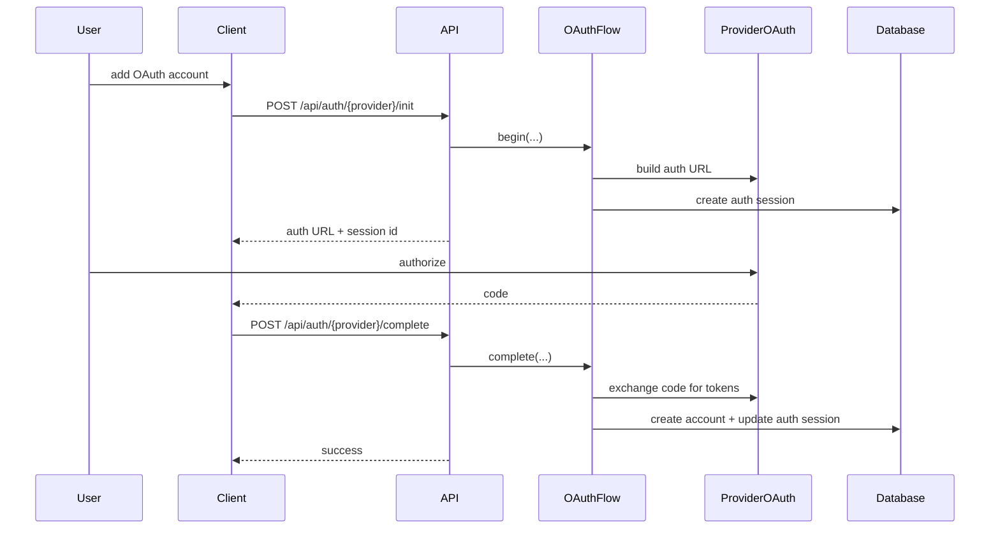
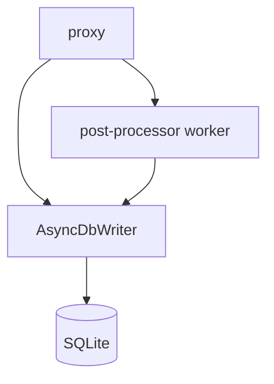

# Data Flow

## Overview

This document describes how requests and management operations move through ccflare today.

The major flows are:

- management/API requests
- proxied provider requests
- websocket proxy requests
- request/log event streaming
- OAuth account onboarding

## Runtime Flow



## HTTP Management Requests

Management endpoints follow this path:

1. request arrives at the Bun server
2. `runtime-server` sends it to `APIRouter`
3. a pre-instantiated handler performs validation and database/repository work
4. the handler returns JSON or SSE via `http`

Examples:

- `/health`
- `/api/accounts`
- `/api/stats`
- `/api/analytics`
- `/api/logs/stream`
- `/api/requests`

## Proxy Request Flow

Provider-native requests follow this path:

1. request arrives at `/v1/{provider}/...`
2. runtime server routes it to the proxy layer
3. proxy resolves the provider implementation
4. proxy/session strategy selects candidate accounts
5. the shared credential manager synchronously refreshes and persists OAuth
   credentials when required
6. provider prepares upstream URL and headers
7. request is forwarded upstream
8. response metadata is normalized
9. request events and persistence work are scheduled

### Proxy Forwarding Sequence



## WebSocket Flow

Websocket-capable provider routes go through the same runtime routing layer, but switch into the websocket proxy path when the request is an upgrade request. One WebSocket connection is represented by one pending `WS` request row from open through close.

Every application frame observed by the proxy is captured before forwarding in a provider-neutral envelope containing its sequence, timestamp, direction, frame type, encoding, and raw data. Envelopes are accumulated into append-only transcript chunks and flushed periodically, at chunk thresholds, on close, and during graceful shutdown. Chunk thresholds control write batching; they do not cap total transcript size.

```mermaid
flowchart TD
    REQ[Incoming /v1/{provider}/... upgrade]
    ROW[Create pending WS request]
    CLIENT[Client frames]
    UPSTREAM[Upstream frames]
    CHUNK[Ordered transcript chunk]
    DB[(SQLite)]
    LIVE[Request-scoped transcript SSE]
    CLOSE[Flush final chunk + finalize request]

    REQ --> ROW
    CLIENT --> CHUNK
    UPSTREAM --> CHUNK
    CHUNK --> DB
    DB --> LIVE
    CHUNK --> CLOSE
    CLOSE --> DB
```

Transcript storage does not classify provider events. The dashboard parses only chunks that are opened for display, so newer parsers can improve historical conversations retroactively. Unknown, non-JSON, and binary frames remain available in their original order.

The raw `/api/requests/:id/conversation` debug endpoint exports a finite persisted-at-start WebSocket snapshot as ordered NDJSON. It pages through chunk storage with bounded server memory, flattens storage-only chunk boundaries, and does not cap the total response size. Live followers use the separate request-scoped transcript SSE endpoint.

## Response and Usage Processing

For HTTP proxy traffic:

- the proxy handles immediate forwarding concerns
- account/rate-limit state is updated
- request metadata is queued for persistence
- background post-processing extracts additional usage, payload, and summary information

For streaming HTTP traffic:

- the proxy emits response chunks and completion metadata to the worker
- the worker parses provider-specific usage events
- full payloads are persisted asynchronously, while only final summaries return to the main thread and request-summary SSE stream

Usage analytics are best effort and never gate proxy responses. If worker
readiness or a message acknowledgement times out, worker health becomes
`degraded`; the worker is retained rather than restarted. Up to 1,000 messages
can wait for readiness, and a late `ready` signal flushes them once. Worker
errors and posting failures stop later analytics delivery without affecting the
request path.

For WebSocket traffic, the main proxy path writes ordered raw transcript chunks directly. This avoids holding an entire long-lived connection in the HTTP post-processor worker and allows an open request detail view to receive newly persisted chunks live. A separate best-effort analytics extractor aggregates recognized `response.completed` usage onto the connection row; it never changes or gates raw transcript capture.

## Event Streaming

ccflare exposes two real-time SSE streams:

- `/api/requests/stream`
- `/api/logs/stream`

### Event Streaming Flow



Request events come from the request-event bus; log events come from the log bus.

## OAuth Account Onboarding Flow

OAuth account onboarding is provider-scoped.



Important note:

- auth flow state is stored in `auth_sessions`
- callback forwarding is provider-scoped and managed by `api`

## Database Writes During Normal Operation

### `accounts`

Updated for:

- account creation
- synchronous credential-guarded token refresh
- request/session counters
- pause/resume state
- rate-limit metadata

### `requests`

Updated for:

- request metadata
- status and timing
- model selection
- token and cost analytics
- failover attempt counts

### `request_payloads`

Updated for:

- full request/response payload persistence
- debugging and request inspection

### `auth_sessions`

Updated for:

- OAuth onboarding state
- completion status transitions
- session expiry management

## Background Work

Background processing exists to keep the request path responsive.

The main mechanisms are:

- `AsyncDbWriter` for non-blocking writes
- the proxy post-processor worker for stream/websocket usage extraction
- the quota refresh job, which runs after listen and hourly with bounded concurrency and no overlapping runs
- the retention cleanup worker, which starts after listen and deletes expired data in bounded, non-overlapping batches

Quota refreshes call the shared account quota service directly rather than
making loopback HTTP requests. They persist display snapshots for the accounts
API. Provider response headers processed on the proxy path remain authoritative
for immediate account gating; cached snapshots do not replace that path. The
manual rate-limit reset endpoint clears only local gating metadata, and the
next natural provider signal can restore it.

The first retention pass begins about 10 seconds after listen; later passes run
every `cleanup_interval_hours`. The dedicated worker removes small child-table
batches before childless request rows, pauses between cycles, and backs off when
foreground writes hold the database. Every delete commits independently, so
shutdown can stop between batches without rollback or special recovery. Manual
requests coalesce with an active pass. Startup performs no retention deletes,
and automatic cleanup never runs `VACUUM`.

### Background Persistence Flow



This keeps forwarding latency low while preserving detailed observability.

## Design Summary

Today’s data flow is intentionally simple:

- `runtime-server` routes
- `api` manages the control plane
- `proxy` manages the data plane
- `providers` own provider-specific parsing/auth details
- `database` persists state and analytics inputs
- dashboard and TUI consume the same management surface
