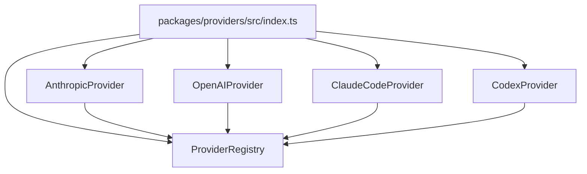
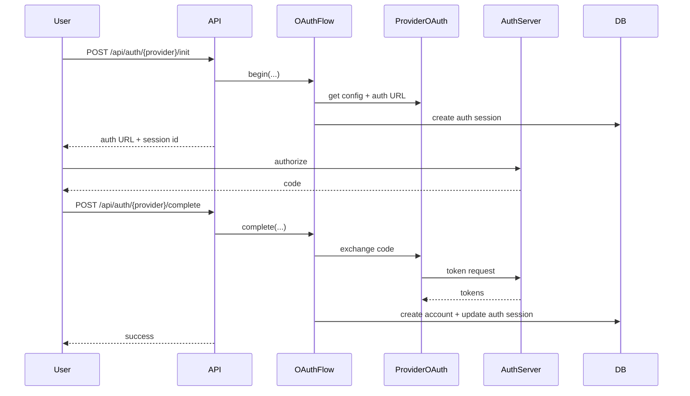

# Providers

## Overview

ccflare’s provider layer gives the rest of the system a consistent way to deal with multiple upstream APIs without collapsing all provider-specific behavior into the proxy.

`packages/providers` owns:

- provider registration and lookup
- provider-specific URL construction
- auth header preparation
- OAuth helper adapters
- refresh-token orchestration
- provider-native quota fetching
- rate-limit parsing
- response/usage parsing helpers

## Built-In Providers

- `anthropic`
- `openai`
- `claude-code`
- `codex`
- `kimi`

These are exposed through `/v1/{provider}/...` routes.

## Provider Registry

The registry is responsible for:

- registering providers
- resolving providers from route prefixes
- exposing provider lists for health and startup banners
- exposing OAuth-capable provider adapters

## Request Routing Model

The runtime proxy receives paths like:

- `/v1/anthropic/v1/messages`
- `/v1/openai/chat/completions`
- `/v1/claude-code/...`
- `/v1/codex/...`

Flow:

1. strip `/v1/{provider}` exactly once
2. resolve the provider implementation
3. select an account for that provider
4. delegate upstream URL/header behavior to the provider

## Authentication Modes

### API-Key Providers

- `anthropic`
- `openai`

These use `api_key` accounts and do not depend on refresh-token flows.

### OAuth Providers

- `claude-code`
- `codex`
- `kimi`

These use provider-specific OAuth adapters plus the shared OAuth flow package. Access tokens may be refreshed automatically during forwarding.

### OAuth Grants

Provider metadata records an `oauthGrant` so onboarding code can branch without
importing provider classes:

- `authorization_code` (`claude-code`, `codex`) — the user opens a redirect URL
  and an authorization code comes back.
- `device_code` (`kimi`) — the user approves at a verification URL and there is
  **no code to paste**; ccflare polls the token endpoint instead.

For device-grant providers `OAuthFlow.begin()` calls the provider's
`beginDeviceAuthorization()` instead of generating PKCE, stores the device code
in the existing session `verifier` slot, and returns the verification URL as
`authUrl` plus a `userCode` for display. `complete()` is then called with an
empty `code`; the provider's `exchangeCode()` polls until the authorization is
approved, denied, or expires.

## OAuth Flow Integration

The provider layer supplies:

- provider-specific auth URL logic
- token exchange logic
- refresh-token request details

## Provider Responsibilities

Each provider implementation owns:

- `buildUrl(...)`
- `prepareHeaders(...)`
- `parseRateLimit(...)`
- optional OAuth adapter hooks
- optional token refresh support
- optional account quota fetching
- provider-format-specific usage parsing

This keeps provider-specific protocol logic out of `runtime-server` and mostly out of `proxy`.

## Account Quota Fetching

`GET /api/accounts/:accountId/quota` asks the selected provider implementation
for live quota data using that account's OAuth credentials. This is a
control-plane operation: it does not select another account or send an
inference request.

Provider implementations own the remote protocol details:

- Claude Code queries `/api/oauth/usage` and `/api/oauth/profile`.
- Codex queries `/wham/usage`, `/wham/accounts/check`, and
  `/wham/rate-limit-reset-credits`.
- Codex derives the optional `ChatGPT-Account-Id` header from the access-token
  JWT in memory and never returns decoded claims.
- Kimi queries `/usages`, which returns the weekly summary, per-window limits
  and the booster wallet in a single payload.

The large Codex `/wham/profiles/me` history is intentionally not fetched. It is
optional in the reference script and does not provide the current quota windows.

The API layer owns local account lookup, token refresh and persistence, and
HTTP error mapping. Independent upstream probes run concurrently so a failed
secondary source does not discard usable quota data. Credential-shaped fields
are recursively redacted before any provider payload reaches the management
response.

`anthropic` and `openai` accounts currently return `501` because this endpoint
only implements the OAuth subscription quota protocols used by Claude Code,
Codex and Kimi.

## Rate Limit Handling

Providers normalize native rate-limit signals into a shared shape consumed by the proxy/database layers.

Examples:

- Anthropic-family providers parse unified Anthropic rate-limit headers
- OpenAI parses OpenAI rate-limit headers when available
- Codex parses Codex-specific reset/usage headers

The proxy uses normalized rate-limit data to:

- mark accounts unavailable
- persist reset metadata
- avoid repeatedly selecting bad candidates

## Usage Extraction

Providers also own the provider-specific pieces of usage parsing.

That includes:

- non-streaming JSON usage parsing
- SSE response summary parsing where available
- cache-read/cache-write token fields
- reasoning-token fields where available

Heavy stream/websocket aggregation still happens in the proxy worker, but provider modules own the provider-specific parsing rules.

## Request Cost

ccflare stores a `costUsd` per request. It has one price source: the models.dev
catalogue (`https://models.dev/api.json`), fetched by `@ccflare/core`'s pricing
module, cached on disk under the temp directory, and refreshed every 24h
(`CF_PRICING_REFRESH_HOURS`). No rates are hardcoded in this repo.

Costs are **list-price equivalents, not billed amounts.** OAuth subscription
accounts bill a flat rate, so the recorded number answers "what would this
traffic have cost at metered prices," which is what makes providers comparable
in analytics.

The catalogue is keyed by provider, so the lookup needs to know which block to
read. `packages/types/src/pricing-catalogue.ts` maps each ccflare provider to:

- the catalogue blocks to consult first, because the same model id is listed by
  many resellers at different rates and object key order is not a pricing
  decision — `claude-code` reads `anthropic`, `codex` reads `openai`, `kimi`
  reads `moonshotai`
- model id aliases, for plans that publish their own ids

Kimi Code needs the aliases. Its plan ids are listed under a `kimi-for-coding`
catalogue block at zero cost because the plan is flat-rate, so they are aliased
onto Moonshot's metered ids (`kimi-for-coding` → `kimi-k2.7-code`,
`kimi-for-coding-highspeed` → `kimi-k2.7-code-highspeed`, `k3` and `k3-256k` →
`kimi-k3`). Claude Code and Codex need no aliases: their model ids already match
the first-party Anthropic and OpenAI entries.

A model id absent from the catalogue logs one warning and records a cost of 0.

## Built-In Provider Notes

### Anthropic

- upstream base URL defaults to `https://api.anthropic.com`
- API-key authentication
- unified Anthropic rate-limit parsing

### OpenAI

- upstream base URL defaults to `https://api.openai.com/v1`
- API-key authentication
- OpenAI/responses usage parsing helpers

### Claude Code

- OAuth-based provider
- Anthropic-family request behavior
- refresh-token support

### Codex

- OAuth-based provider
- Codex-specific backend route handling
- custom headers and rate-limit parsing

### Kimi

- OAuth-based provider using the device authorization grant
- upstream base URL defaults to `https://api.kimi.com/coding/v1`
- OpenAI-compatible chat-completions upstream, so URL building, rate-limit
  parsing and usage extraction are inherited from the OpenAI provider
- access tokens are short-lived (900s), so refresh happens frequently and the
  refresh token is rotated on each refresh
- plan model ids are aliased onto Moonshot's metered ids for costing; see
  [Request Cost](#request-cost)
- quota fetching probes `{baseUrl}/usages`, the same endpoint the kimi-cli
  usage view polls

## Adding a New Provider

To add one cleanly:

1. implement the provider class
2. implement OAuth helpers only if the provider needs OAuth
3. register it in `packages/providers/src/index.ts`
4. add provider metadata in `packages/types/src/provider-metadata.ts`
5. add tests for:
   - route resolution
   - headers
   - token refresh, if applicable
   - rate-limit parsing
   - usage extraction, if applicable

## Design Rule

Provider-specific facts belong in the provider layer or provider metadata, not in the runtime server.

That keeps:

- runtime orchestration generic
- proxy logic provider-agnostic where possible
- provider behavior easy to test in isolation
